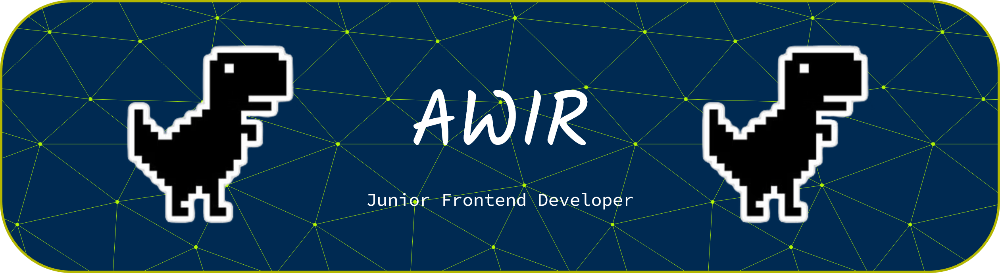

<table align="center">
  <tr>
    <td>
      <h1 style="color:#8B5CF6; margin:0;">THIS IS ME</h1>
    </td>
    <td>
      
    </td>
  </tr>
</table>

**Junior Frontend Developer | Web Enthusiast**

  

---

## 💫 About Me

Saya sedang belajar **Frontend Web Development** dengan fokus pada pembuatan antarmuka web yang responsif, rapi, dan mudah digunakan.

Saat ini saya mendalami **HTML, CSS, JavaScript**, serta mulai membangun project menggunakan **React**. GitHub ini saya gunakan sebagai dokumentasi proses belajar dan pengembangan skill frontend saya.

---

## 🌐 Socials

---

## 💻 Tech Stack

#### Core Frontend

#### Framework & Styling (Primary)

#### Tools & Workflow

---

## 🎯 Current Focus

- Memperdalam React dan component-based architecture
- Responsive & mobile-first design
- Integrasi REST API di frontend
- Menulis kode yang lebih bersih dan terstruktur
- Membangun project frontend yang konsisten
- Memahami best practice UI dan clean code
- Siap melamar **Internship / Junior Frontend Developer**

---

